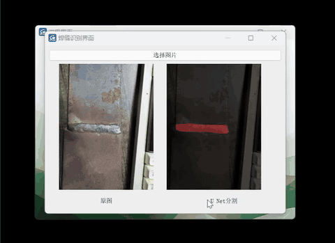
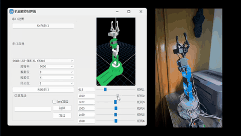

# HMI

面向幻尔科技 Hiwonder LeArm 机械臂平台的非官方二次开发上位机，主要用于焊缝识别、UNet 图像分割推理，以及机械臂数字孪生滑块控制演示。

本项目基于两个公开项目进行学习、适配和集成开发：机械臂三维显示与 Qt/OpenGL 交互部分参考 [eagleqq/Robot3D](https://github.com/eagleqq/Robot3D)，焊缝图像分割的训练、推理与 mIoU 评估流程基于 [bubbliiiing/unet-pytorch](https://github.com/bubbliiiing/unet-pytorch)。在此基础上，本项目完成了 LeArm 机械臂模型适配、Qt 上位机界面整合、焊缝识别推理调用、滑块式关节仿真控制、本地复现与桌面应用打包验证。

本仓库不是幻尔科技官方项目，也不是上述参考项目的官方分支。当前主要用于个人作品展示、学习研究和本地演示。

## 项目边界

- 代码：包含 Qt/C++ 上位机、OpenGL 机械臂显示、Python UNet 训练与推理代码。
- 数据集：焊缝分割数据集由项目作者自行采集，不直接提交到 Git。
- 权重：焊缝分割权重由项目作者训练得到，不直接提交到 Git。
- STL：LeArm 机械臂 STL/结构模型不随仓库提供，需要用户自行准备有权使用的模型文件。
- 可执行包：公开发布包默认不包含 STL 文件；本地私有打包可显式启用 STL 复制。

## 许可证

本仓库不声明一个覆盖全部内容的统一许可证，各部分边界如下：

| 内容 | 许可证 / 状态 |
| --- | --- |
| 焊缝分割数据集 | [CC BY 4.0](docs/licenses/dataset-cc-by-4.0.md) |
| 自训练 UNet 权重 | [Apache License 2.0](docs/licenses/model-weights-apache-2.0.md) |
| LeArm STL/结构模型 | 不随仓库提供，不授权二次分发 |
| 第三方参考项目 | 见 [THIRD_PARTY_NOTICES.md](THIRD_PARTY_NOTICES.md) |
| 仓库代码整体 | 当前不声明统一开源许可证 |

## 功能

- Qt 上位机界面
- LeArm 机械臂 STL 模型加载与 OpenGL 显示
- 滑块式独立关节控制与数字孪生演示
- 串口与机器人控制界面
- 焊缝图像选择、分割与结果显示
- UNet 训练、预测和 mIoU 评估脚本
- 本地复现脚本和 macOS/Windows 打包脚本

## 演示视频

| 机械臂识别到焊缝 | 滑块控制独立关节 |
| --- | --- |
| [](https://youtu.be/_f371G87iBs?si=kt9yl1vsSmSuFXPl) | [](https://youtu.be/tFxSIknCsfQ?si=BHSCSx6OC0wbLYiz) |

原视频链接：

- [机械臂识别到焊缝的效果视频](https://youtu.be/_f371G87iBs?si=kt9yl1vsSmSuFXPl)
- [通过滑块控制机械臂各个独立关节的场景](https://youtu.be/tFxSIknCsfQ?si=BHSCSx6OC0wbLYiz)

## 目录结构

```text
.
├── HMI.pro                 # Qt qmake 工程文件
├── *.cpp, *.h, *.ui        # Qt/C++ 上位机源码和界面文件
├── *.py                    # 分割模型训练、预测、数据处理脚本
├── nets/                   # UNet 网络结构
├── utils/                  # 训练、数据加载和评估工具
├── res/
│   ├── binary/             # STL 占位说明，实际模型文件不随仓库提供
│   └── image/              # Qt 资源图片
├── model_data/             # 模型权重占位目录，不提交 .pth
├── docs/                   # 复现、打包、数据集和权重说明
└── scripts/                # 本地环境示例和打包脚本
```

## 环境

- Qt 5.13 或兼容版本
- C++17
- Python 环境
- PyTorch 及依赖，见 `requirements.txt`

安装 Python 依赖：

```bash
pip install -r requirements.txt
```

`requirements.txt` 记录的是本项目复现时使用的旧版依赖组合。迁移到新 Python/PyTorch 版本时需要重新验证训练、推理和 Qt 调用流程。

## 本地配置

复制示例环境文件并按本机路径修改：

```bash
cp scripts/hmi_local_env.example.sh scripts/hmi_local_env.sh
. scripts/hmi_local_env.sh
```

真实的 `scripts/hmi_local_env.sh` 已被 Git 忽略，避免提交本机路径。

Qt 构建前至少需要设置：

```bash
export PYTHON_HOME=/path/to/python/env
export PYTHON_VERSION=3.9
```

Windows 示例：

```bat
set PYTHON_HOME=C:/path/to/python-env
set PYTHON_VERSION=3.9
```

如果运行目录无法自动找到 `predict.py` 或本地提供的 `res/binary/*.STL`，设置：

```bash
export HMI_PROJECT_ROOT=/absolute/path/to/HMI
```

图像分割按钮会启动 `python predict.py <image>`。如需指定 Python 可执行文件：

```bash
export PYTHON_EXECUTABLE=/path/to/python
```

## 模型权重

本地运行焊缝识别需要 `.pth` 权重文件：

```text
model_data/seam_unet.pth
```

`.pth` 文件已被 `.gitignore` 默认忽略。建议通过 GitHub Releases 或外部存储分发模型文件，避免把大二进制文件写入 Git 历史。

## 数据集与权重发布包

本项目使用的焊缝分割数据集由项目作者自行采集，模型权重由项目作者基于该数据集训练得到。为了避免大文件进入 Git 历史，数据集和权重不直接提交到仓库。

建议公开资产命名：

```text
hmi-weld-seam-voc-dataset.zip
hmi-weld-seam-unet-weights.zip
```

数据集压缩包内部保留 Pascal VOC 兼容结构：

```text
hmi-weld-seam-voc-dataset/
└── VOC2007/
    ├── JPEGImages/
    ├── SegmentationClass/
    └── ImageSets/
        └── Segmentation/
```

数据集说明见 `docs/datasets/hmi-weld-seam-voc-dataset.md`，权重说明见 `docs/models/hmi-weld-seam-unet-weights.md`。数据集采用 CC BY 4.0，权重采用 Apache License 2.0。

## LeArm STL 模型

本项目的机械臂数字孪生显示需要 LeArm 各关节 STL 文件，但仓库不提供这些模型文件。

本地运行时，请从你有权使用的幻尔科技 Hiwonder LeArm 机械臂模型资源或授权来源准备 STL 文件，并放入：

```text
res/binary/
```

默认代码期望的文件名如下：

```text
base_link.STL
link_1.STL
link_2.STL
link_3.STL
link_4.STL
link_5.STL
```

这些 STL 文件已被 `.gitignore` 忽略，只用于本地运行和私有演示。公开 GitHub Release 不应包含这些文件，除非已经确认二次分发授权。

## 默认登录

当前演示版本使用默认账号：

```text
username: admin
password: admin
```

该登录流程只用于演示界面切换，不应视为生产级身份认证。

## 本地复现

详见 `docs/reproduction/local-reproduction.md`。

最小流程：

```bash
cp scripts/hmi_local_env.example.sh scripts/hmi_local_env.sh
. scripts/hmi_local_env.sh
pip install -r requirements.txt
python predict.py /path/to/test-image.jpg
```

Qt 构建：

```bash
mkdir -p build-HMI-local
cd build-HMI-local
qmake CONFIG+=release ../HMI.pro
make -j"$(sysctl -n hw.ncpu)"
```

## 打包发布

本项目提供 macOS 和 Windows 打包脚本，用于生成包含 Qt 依赖、项目资源、模型权重和 Python 运行时的可分发目录或压缩包：

```bash
scripts/package_macos.sh
```

```powershell
powershell -ExecutionPolicy Bypass -File .\scripts\package_windows.ps1
```

打包脚本默认排除 `res/binary/*.STL`。如果只是制作本地私有演示包，并且你确认有权使用这些 STL 文件，可以显式启用：

```bash
export HMI_INCLUDE_LOCAL_STL_ASSETS=1
```

```powershell
$env:HMI_INCLUDE_LOCAL_STL_ASSETS = "1"
```

详见 `docs/reproduction/packaging.md`。

## 参考项目与授权边界

第三方来源与许可证说明见 `THIRD_PARTY_NOTICES.md`。

- [bubbliiiing/unet-pytorch](https://github.com/bubbliiiing/unet-pytorch)：UNet 训练、推理和 mIoU 评估流程的主要参考项目，原项目采用 MIT License。
- [eagleqq/Robot3D](https://github.com/eagleqq/Robot3D)：Qt/OpenGL 机械臂三维显示、STL 加载和关节控制部分的主要参考项目。
- LeArm 机械臂 STL/结构模型：本仓库只说明适配方式和期望文件名，不提供 STL 文件。
- 模型权重：`model_data/seam_unet.pth` 为本项目任务场景下训练得到的权重文件，默认不提交到 Git 仓库。

本仓库当前不声明一个覆盖全部内容的统一开源许可证。公开发布前仍应确认代码、STL 资源和第三方依赖的许可条件；数据集与权重的许可证以上述说明为准。
